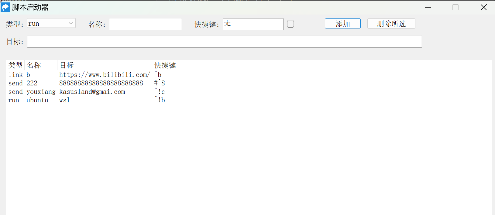

#  AHK Shortcut

 （ seeyoufarm hits 没有了现在重新计数了）

AHK Shortcut 是快捷键管理工具，通过图形界面，轻松设置和管理各种快捷键操作，如打开网页、运行程序、打开文件夹、发送文本等。

## 功能特点

- 🚀 支持多种操作类型：
  - `link`: 打开网页链接
  - `run`: 运行程序或命令
  - `open`: 打开文件夹
  - `send`: 发送文本
  - `ahk`: 执行 AHK v2 代码 (例如 `Send(FormatTime(, "yyyy-MM-dd HH:mm:ss"))`)
- 💡 直观的图形界面
- 🔄 支持自行备份配置文件、可以快速的迁移快捷键到其他电脑

## 安装

1. 前提
   - 下载并安装 [AutoHotkey v2.0](https://www.autohotkey.com/download/ahk-v2.exe)

2. 下载本项目
   - 下载并解压本项目文件到任何文件夹

3. 运行程序
   - 双击运行 `ahkshortcut.ahk`

## 使用

1. 添加快捷键
   - 选择操作类型Type
   - 输入名称Name（可选）
   - 设置快捷键组合Hotkey (点击输入框直接录制,由于系统限制，不支持录制win,**所以需要手动勾选WinKey**)
   - 输入Target（网址link/程序路径run/文件夹open/文本send）
   - 点击"Add"按钮 添加快捷键

2. 管理快捷键
   - 编辑：选中项目后点击"Edit"编辑快捷键,编辑后需要点击"Add"按钮保存
     - tip : 可以直接选中列表中的某个快捷键,按Enter键编辑快捷键
   - 删除：选中项目后点击"Delete"删除快捷键

3. 设置
   - 点击右上角设置按钮打开设置窗口
   - 设置全局快捷键(展示/隐藏快捷键管理器)
   - 设置是否启动时隐藏（Hide on Launch）

## 相关推荐

如果你喜欢这个工具，你肯定是一个快捷键大师，也可以看看这些工具：

- [Alt-Drag](https://github.com/cornradio/alt-drag-mac) - 使用 Alt+鼠标调整窗口位置和大小
- [lightspeed-UI](https://github.com/cornradio/lightspeed-UI) - 管理程序、使用快捷键启动程序和文件夹

## 许可证

[MIT License](LICENSE)

## 更新日志
- 2025-01-13 增加了多行文本send支持
